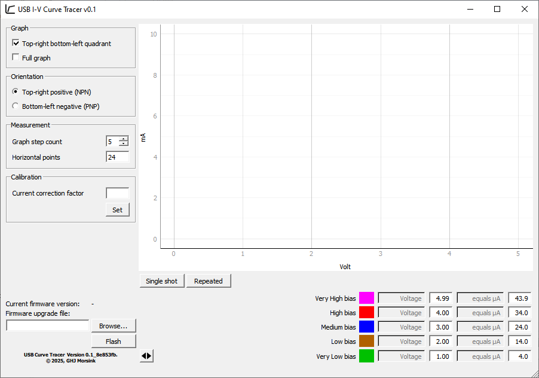
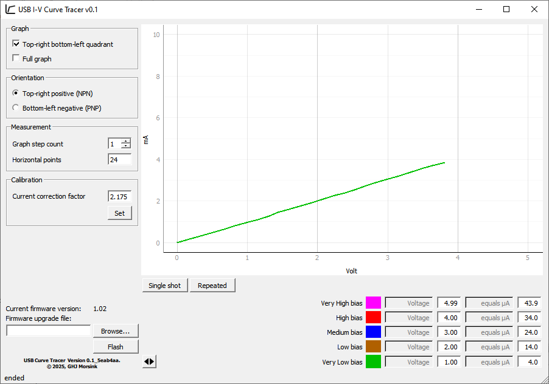
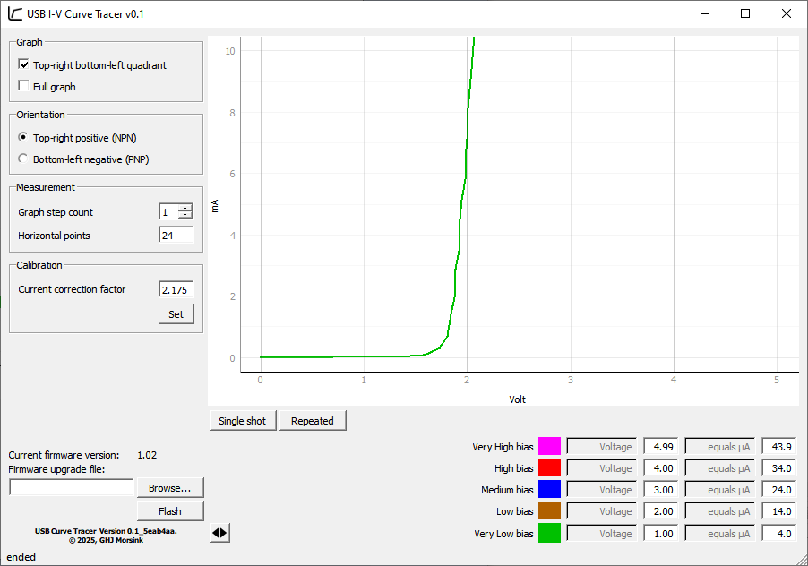
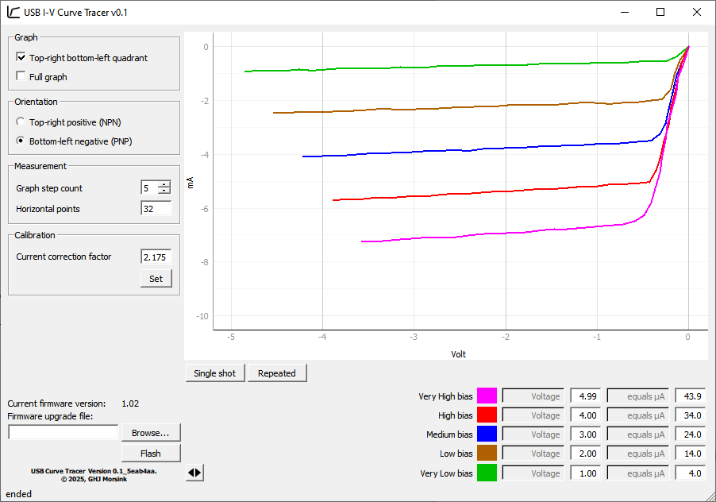
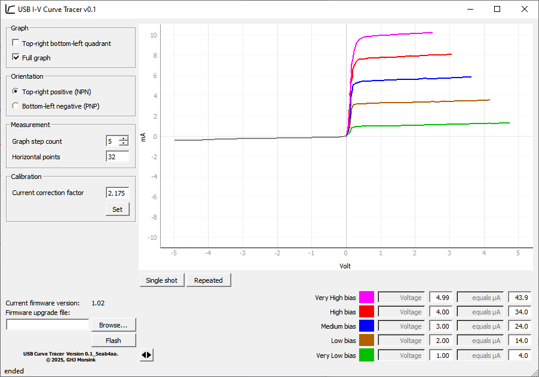

# PC_CurveTracer

*Curve tracing for bjt transistors, FETs, diodes and more through ATMega micro and PC*

## Introduction

This project builds an I-V Curve Tracer connected to a computer using USB. A curve tracer is a type of instrument used to 
measure the current through a device with varying voltages across it. It is a specialized piece of electronic test equipment 
to analyze the characteristics of discrete electronic components, such as diodes, and transistors. The device contains 
voltage and current sources that can be used to stimulate the device under test (DUT). The curve tracer applies a continuously 
varying voltage to two terminals of the device under test and measure the amount of current that the device permits to flow 
at each voltage. This so-called I-V (current versus voltage) data is directly displayed on an oscilloscope screen in X-Y mode.
Examples of full featured Curve tracers which can go to more than 100 Volt and currents into several amps are the Textronix 576, 577, 
and the Leader LTC-905. Simpler (and cheaper) solutions are based on a simple transformer with a few resistors like 
in [Changpuak's curvetracer](https://www.changpuak.ch/electronics/Curve_Tracer_advanced.php). All of these need an oscilloscope 
as the display device.
This project builds one which does not use an oscilloscope, but shows the data, and the controls on a computer. The interface 
to the computer is through USB, and the power is also taken from the USB connection. This means the device can only handle 
signal-sized discrete components up to 5 Volt and a maximum of about 10 mAmpere.

## Hardware

The hardware used is based on a simple microcontroller (good old Atmel ATMega8) which generates the varying voltages with two PWM-DAC based outputs. 
The measurements are done with the internal ADC. For switching between NPN and PNP transistors (or N-mosfets and P-mosfets) one 
of the digital outputs is used.
The USB connection is based on the V-USB package of OBDev [V-USB](https://github.com/obdev/v-usb).
The power section for the DUT contains an opamp for buffering the DAC output, so it can sink and source currents. The resistor 
measures the current and creates at the same time a current limiting function. The second opamp is arranged as a current to 
voltage convertor with some gain so that about 10 mA gives a full scale for the ADC. Note that the ground reference for the 
floating current convertor is switched to accommodate for positive and negative currents. Also be aware the opamp’s inputs 
and outputs must reach rail to rail voltages. The control connection for the DUT (the base, or the gate) has fairly simple set-up 
from the second PWM-DAC with one RC-filter and a high value resistor; FETs get a voltage, bipolar transistors get a small current.

## Firmware

To be able to connect to the device without needing a software driver, the system will work as a HID device. Communication will 
be on the features report channel. The device and the used protocol has the capacity for 16 different modes with each 8 functions. 
At the moment only the mode for measuring a trace and resetting (for firmware updates) are implemented. The functions are 
initializing, reading measurements, and reading and setting calibration data. More modes and funtions can be created in the 
future; there is still enough room on an ATMega8. One can think of an automated hFE measurement mode and likewise modes for FETs.
Creating one trace is done by the initializing command containing the info for the used bias voltage (and this determines 
directly the bias current in cases of bipolar transistors), the number of measurement points, and the polarity to be used. 
After the initialization the requested number of measurements can be retrieved. There are also commands for setting and reading 
calibration values, which are needed for correction of the current to voltage conversion. The calibration is used at PC 
software level, and stored on the device because it is 'attached' to the components of that device.

The firmware contains a hid-based usb bootloader. This helps in a simple system where updates of the firmware can be transported 
conveniently to the device. The software supports this mechanism (it was used heavily during development).

## Software

The controlling GUI is built using a Python script. The graphics are made using the PyQT and pyqtgraph packages. The connection 
with the device is through USB using the pywinusb package. Starting the GUI through main.py gives the following window:

It defaults to top-right quadrant for 5 traces, good for a normal npn transistor.

Within the application it is possible to update the firmware, so new features can be introduced. There is also a bootload.py 
script which gives the possibility to update the firmware or give it the initial firmware using the console.

## Results and calibration

Connecting the hardware to the computer, and starting the software conveniently through the CurveTracer.bat file gives the 
opportunity to calibrate it. This calibration is necessary only once. Put a 1kOhm resistor (1%) in the hardware between the collector 
and emitter pins, and do a 'single shot' measurement. You should see a straight line through points 0mA/0V,  1mA/1V,  2mA/2V, and 3mA/3V. 
If the line isn't correct, you can adjust it by changing the 'Current correction voltage', 'Set' it, and do a new measurement.

A view of some other measurements are in the next pictures. A LED, a pnp transistor (BC213) and a npn transistor (2SC945). The last 
one in full graph mode: you get a single trace in the opposite quadrant, without any base/gate stimulation.

Note: You can right-click on the graph for saving the picture and other goodies, supplied out of the box from the pyqtgraph package.

## Tooling and other notes

The hardware is developed with a somewhat older version of CadSoft's EAGLE pcb design software, now part of Autodesk Fusion Software.
Version 7.5.0 was used. For reference the schematic and the pcb design are also given as pdf document.
The firmware is written using the Microchip Studio 7.0 environment. You can get it through the URL [https://www.microchip.com/en-us/tools-resources](https://www.microchip.com/en-us/tools-resources/develop/microchip-studio#Downloads); older Atmel versions will work as well. 
The firmware is with minor or no changes also usable on the ATMega88 and the bigger ATMega168 and ATMega328. The fuse settings 
for the microcontroller can be found in the document [Fuses.txt](./embedded/fuses.txt).
For convenience a hex file containing the image for the application and the bootloader is in the file ./embedded/full.hex.
The PC software is fully based o Python. Version 3.12 was used during development, any version in the 3-series should be fine. 
The requirements.txt contains the names of the needed packages to conveniently install them using 'pip'. For users who want to 
adapt/develop the software to their likings, it is advised to install QT Designer as well.

